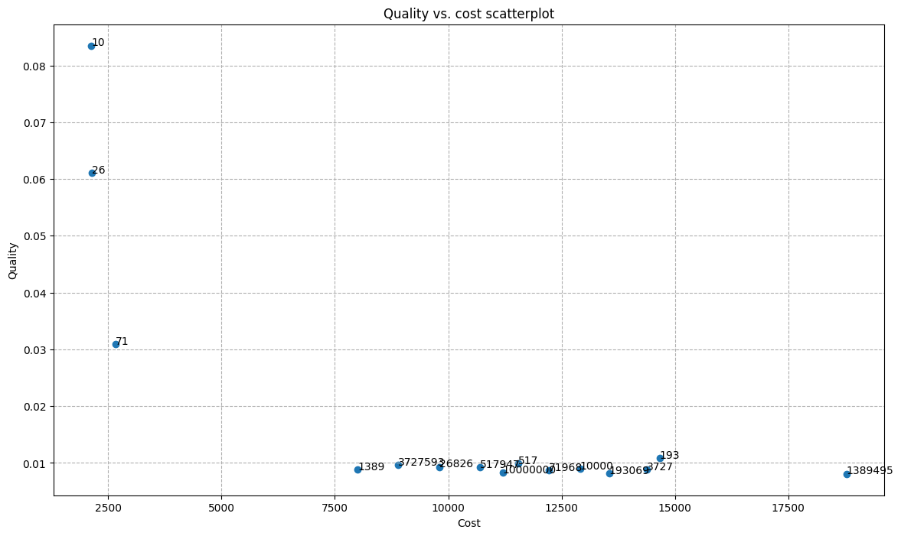
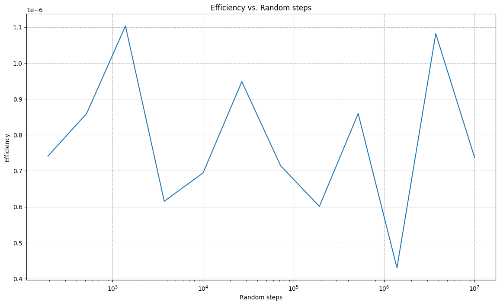
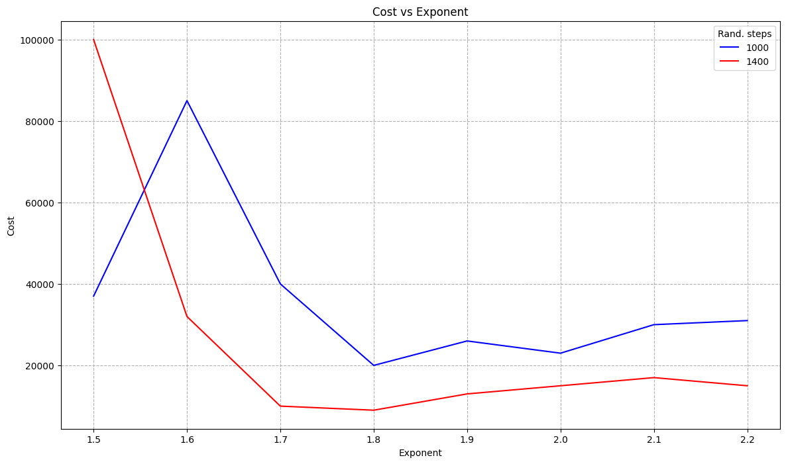
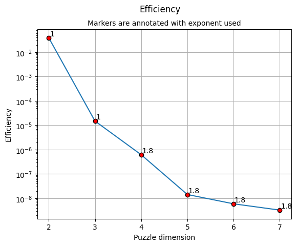

# Lab 3 - N-puzzle problem

## Repository overview
The solution for this problem is implemented in the notebook [n-puzzle.ipynb](n-puzzle.ipynb).

The following folders are provided:
- [final](final/): final results of the problem in JSON, plot of the efficiency vs. puzzle size  
- [heuristic exponent experiment](exp_experiment/): plots of different metrics vs. exponent used to increase the heuristic value
- [random steps experiment](step_experiment/): plots of different metrics vs. initial random steps

## Official solution
The solution is given using A* approach for size N, such that $2 \leq N \leq 7$. Larger problems have time issues.

### Problem initialization
Since the game is not guaranteed to have a valid solution (and we want how algorithm to converge), the initialization is implemented by starting from the final *goal* configuration and randomly perform actions to move the empty tile in other positions.

The result of this operation is set as the initial state of the problem.

### Metrics
The following metrics are used:
- **quality**: measures how good a solution is, defined as: $quality(p) = \frac{1}{|p|}$, where *p* is the solution path
- **cost**: measures how much the algorithm has explored the state space to find the final solution, defined as: $cost(p) = |A|$, where *A* is the set of performed actions, that is equal to the number of calls to the *do_action* function
- **efficiency**: measures how good a solution is, with respect to the number of explored states and it is defined as: $efficiency(p) = \frac{quality(p)}{cost(p)}$. It is better when larger. Since the goal is to maximize efficiency, we look for solutions that maximize quality (thus, that minimize solution path length) and minimize cost.

### A* approach
A* allows to find the best solution in path search if an admissible heuristic is defined, by working in an informed way. 

However, for $N \gt 3$, admissible heuristics converge too slowly, thus a trade-off between optimality a convergence is needed. To figure out how to set the parameters of the problem, that are:
- type of heuristic to use, eventually scheduled
- initial random steps
- parameters of the heuristic chosen

some experiments have been carried out.

#### Experiments
The following experiments are focused on understanding how the variation of one of the previously mentioned parameters can influence the final result. They have been executed on 4-sized problem.

##### Heuristic type
In this experiment ([code](n-puzzle.ipynb#Heuristic-modification)), different heuristics are used, both fixed and scheduled. They are the following:
- **exponential manhattan distance**: the sum of all manhattan distances of each tile position to their goal position is summed and raised to an exponent $e \in \{2,3\}$
- **step scheduled manhattan distance**: similar to the previous one, but the exponent is tuned depending on parameters *STEP_SIZE* and *TEMPERATURE*
- **arctan scheduled manhattan distance**: similar to the previous one, but the exponent is tuned smoothly, depending on *arctan* function and a *STEP_SIZE* parameter

The experiment is carried out on 15 different trials, and the results are averaged among them.

It is shown that:
- step scheduling is the best solution in terms of quality 
- exponential fixed heuristic (with $e = 2$) is the best solution in terms of both cost and efficiency, thus it is chosen as baseline for the next experiments

##### Initial random steps
The main focus of this experiment ([code](n-puzzle.ipynb#Test-for-randomizer-step)) is to figure out if (and how) the value of the initial random steps influences the final result, in terms of cost, quality and efficiency. In particular, the main interest is to discover if values larger than a certain threshold produce similar results, and which are the best among them.

This experiments explores values of random steps in a logarithmic space, performing 15 trials. For each of them, 10 trials are again executed, to average the final results on different initial states, created using the same amount of random steps.

The results highlight that the quality of the solution is independent from the number of random steps, for values larger than 200. To have a safe margin, 1000 is chosen as lower bound. 

Since cost is influenced by the initial random steps, the efficiency has a variable trend, with some minimums around 1400, 200'000 and 1'000'000.

However, 200'000 and 1'000'000 are associated with higher costs, thus they are discarded for the next experiment: since these parameters are been tuned only on 4x4, it is better to be more conservative and prioritize cost instead of efficiency here.

##### Heuristic parameter
Here ([code](n-puzzle.ipynb#Fine-grained-fixed-exponent)) is to figure out the best exponent for the heuristic chosen [here](#heuristic-type), together with the best value of initial random steps, chosen among the values found [here](#initial-random-steps). In particular, 1000 is tried anyway, due to both its closeness to 1400 and the very low cost of this solution (here a 4x4 game is used, but it is necessary to find a good exponent to make this approach as scalable as possible). 

This experiment is carried out on 10 different trials for each value of initial random steps. For each of these trials, 8 values of exponents are used, such that $1.5 \leq e \leq 2.2$.

The results are collected for each value of initial random steps and exponent, and are averaged on trials.
In the following plot, we can put an upper bound for cost at 20'000 (which corresponds to about 4 seconds execution), for the same conservative reason as above; the following exponent values are selected:
- 1000 random steps: $e = 1.8$, which is the minimum
- 1400 random steps: $e \geq 1.7$, where the minimum corresponds to $e = 1.8$

By considering efficiency, it is clear how much using 1400 random steps could be better in general, with a larger improvement around 1.7-1.8

Finally, the following setup is chosen:
- random steps: 1400
- exponent: 1.8

#### Solution
##### Setup
Summing up the experiments result, these are the parameters values for the algorithm:
- initial random steps: 1400
- heuristic function:  $h(state) = [\sum_{i=1}^{N} \sum_{j=1}^{N} manhattanDistance(state_{i,j}, goal_{i,j})]^{1.8}$ 

where $goal_{i,j}$ is the goal position for the tile contained in $state_{i,j}$

##### Procedure
The algorithm is evaluated on different number of trials, depending on the size of the problem. Each trial starts from a different initial state, but they all share the same goal state, initial random steps and heuristic function.

The results (quality, cost) are averaged on all trials, for a single size instance of the problem; then, efficiency is computed as the ratio of these average values. A more detailed view of the results is provided [here](#results).

##### Data structures
Inside the A* algorithm, the following data structures are used:
- **open_set**: set of states to visit, but not yet explored, implemented with a min-heap structure to emulate a priority queue; each entry contains three fields:
  - *cost*: the total cost $f(n) = g(n) + h(n)$, used to keep the order among the states
  - *state*: the state matrix of the node, implemented as a *State* class, to provide hashability for NumPy arrays 
  - *path*: the path to reach the current node, starting from the initial state
- **closed_set**: set of states already visited
- **past_len**: map of states already visited, together with the deterministic cost *g(n)*

##### Algorithm
The algorithm follows these steps:
1) Initialization: the initial state is put in the open and closed set, and its cost *g(n)* is set to 0
2) Iterate until *open_set* is empty:
   1) The top state of heap is extracted: it is the one with the minimum total cost *f(n)*
   2) If this state is the goal state, the algorithm has converged and returns the path
   3) Otherwise, the algorithm iterates over the possible actions, (which depend on the position), finding the neighbors of the current state; only if a neighbor has not been visited yet or its current cost *g(n)* is worst (larger) than the one it would have if passing from the current node, the following actions are performed:
      1)   Update the cost *g(n)* for the neighbor: $g(neighbor) = g(current) + 1$
      2)   Compute the new cost *f(n)* for the neighbor: $f(neighbor) = g(neighbor) + h(neighbor)$
      3)   Insert the current neighbor, as (*f(neighbor)*, neighbor state, path + current action) in the *open_set*, respecting the ordering property
      4)   Insert the current neighbor in the *closed_set*
3) If the algorithm arrives here means that the open set is empty and the goal state has not been reached: this should not happen, since the initial state is created by performing a finite number of actions from the goal state; thus, there should exists a path from the chosen initial state to the goal state.

## Results
The results are summarized in the following table:

|Problem size   |Quality|Cost|Efficiency|Trials|
|:-----:        |:--: |:--:|:--: |:--:|
|2              |0.2941 |7.6        |3.87e-02 |10   |
|3              |0.0476 |3197.8     |1.49e-05 |10  |
|4              |0.0083 |13452      |6.17e-07 |10 |
|5              |0.0036 |253725.2   |1.44e-08 |5|
|6              |0.0026 |433519.5   |5.96e-09 |2|
|7              |0.0018 |548205     |3.29e-09 |1|

The following plot shows the trend of the efficiency, and it provides annotations for the exponent used in the heuristic

## Observations
We can observe that efficiency decreases as the puzzle dimension, probably due to:
- from N = 2 to N = 3, the huge relative increase of the search space
- from N = 3 to N = 4, the usage of a non-admissible heuristic: it allows to compute a solution in reasonable time, but it is sub-optimal
- from N = 4 onwards, the limited number of trials may lead to biased solutions

## Collaborations
The following parts:
- basic idea behind heuristic exponentiation
- priority queue implementation

have been done in collaboration with [Vincenzo Avantaggiato](https://github.com/VincenzoAvantaggiato). 
